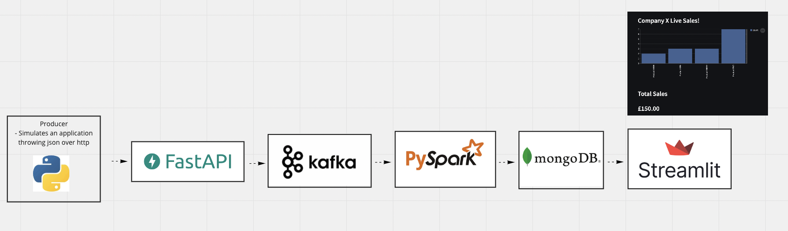

### Streaming / Viz ETL


##### Pipeline


##### Overview

This application will generate some example sales data, push to Kafka via FastAPI, use PySpark to monitor the topic and push to a mongoDB database.  Finally Streamlit is used to show a real time view of the data being generated.


Fancied learning some new tech, so this gave me an exposure to the following
- `FastAPI`: https://fastapi.tiangolo.com/
- `Apache Kafka`: https://kafka.apache.org/
- `Pyspark Streaming`: https://spark.apache.org/docs/latest/structured-streaming-programming-guide.html
- `MongoDB`: https://www.mongodb.com/
- `Streamlit`: https://streamlit.io/

##### Deployment

```
docker compose up -d
```

This will spin up a Flask api on port `80`, the `produce.py` submits some data via `http://127.0.0.1:80/produce/sales` end point.
View the live streamlit dashboard at `http://127.0.0.1:8051`

##### Start a producer
```
pip install requests
python -m producer.py
```

##### TODO
- [x] Inital local working version 
- [x] Dockerise Kafka
- [x] Dockerise PySpark
- [x] Dockerise Streamlit
- [x] Dockerise FastAPI
- [x] Docker Compose
- [ ] End to End Test

#### Notes
When builidng images for `consumer` and `producer` set the context to root dir, this allows us to use the `scripts/kafka-wait.py` script.
